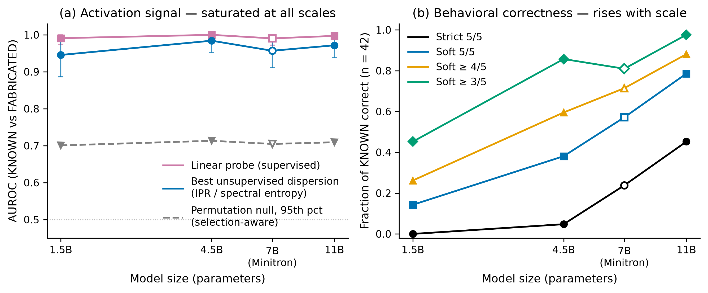

# Does Bielik Know What It Doesn't Know?

**Activation-dispersion hallucination signals in the Bielik model family.**

Author: **Grzegorz Brzezinka** (Prosit AS)
Contact: greg@prosit.no
Paper: [arXiv:2607.07670](https://arxiv.org/abs/2607.07670)

**Status:** the long version (this repository) is being prepared for arXiv; a
condensed version is currently under peer review (venue withheld for double-blind
review). I'll happily welcome feedback!

---

Large language models hallucinate most readily about entities they have never
seen. This project asks whether a Bielik model's **activations betray entity
familiarity before a single answer token is generated** — and, separately,
whether that internal signal says anything about the **factual correctness** of
the answers it goes on to produce. It turns out these are two different things,
moving on two different scaling curves.

## TL;DR findings

- **Entity familiarity is legible in a single forward pass.** Two unsupervised
  dispersion measures over post-SwiGLU MLP activations — inverse participation
  ratio and spectral entropy — separate *known* from *fabricated* entities with
  **AUROC 0.94–0.98** across four entity domains and all four model scales
  (1.5B–11B). A supervised linear probe reaches **0.99–1.00**. Both clear a
  selection-aware permutation floor of ~0.62–0.64 (empirical *p* ≤ 10⁻³).
- **Two different scaling curves.** The *representational* familiarity signal is
  already saturated at 1.5B. *Behavioral* factual correctness scales sharply:
  under a strict judge, **0, 2, 10, and 19 of 42** known athletes are answered
  fully correctly by the 1.5B, 4.5B, 7B, and 11B models (6, 16, 24, 33 under a
  soft key-facts rubric). **Familiarity ≠ correctness.**
- **The signal is about the entity, not the string.** Known vs *real-but-obscure*
  entities still separate at 0.96–1.00, so fabricated-string lexical artifacts
  are not the driver. It also survives held-out layer selection (0.93–0.99).
- **It transfers across entity types.** A probe trained on one domain and
  evaluated on another keeps a **mean off-diagonal AUROC of 0.985–0.998 among
  the "people" domains** (athletes, writers, musicians); the only large drops
  come from a prompt-template shift (cities use a different question stem), not
  from entity type. Per-head attention analysis shows the signal is diffuse, not
  carried by a small fixed set of heads.
- **A causal template control and a cross-family check both replicate the
  dissociation.** Re-extracting cities and writers under one shared neutral
  prompt stem shows the transfer drop is template-caused, not entity-caused
  (recovers to 0.999–1.000). A compact control on a non-Polish-centric family
  (Gemma-4, two sizes, identical dataset and pipeline) qualitatively replicates
  both the familiarity signal and the familiarity/correctness dissociation.
- **The models almost never abstain.** An LLM audit of all **2,520** sampled
  athlete answers finds **2 refusals and 1 hedged answer** (99.88% direct
  assertions) — both refusals from the largest model. The internal awareness is
  there; the behavior does not act on it.
- **Cheaper than sampling baselines.** A five-sample semantic-entropy baseline
  reaches only **0.71–0.83** on the known-vs-fabricated contrast at **5× the
  inference cost** (though it wins the harder correct-vs-hallucination contrast,
  up to 0.87, where dispersion does no better than a first-token-entropy
  baseline).



*Figure 1 — the representational familiarity signal (left) is saturated by 1.5B,
while behavioral factual correctness (right) climbs with scale. The two axes are
distinct phenomena.*

---

## Hallucination-risk tool

An end-user CLI that, given a Polish question, returns (a) Bielik's answer and
(b) a **calibrated probability that the answer is a hallucination-from-ignorance**
— i.e. that the model does not actually know the entity/topic and is
confabulating. It reads only the prompt-side activations, so the risk estimate is
invariant to decoding settings (greedy vs sampled scores are byte-identical).

### Quickstart

Requires [`uv`](https://github.com/astral-sh/uv), Python ≥ 3.11, and Hugging Face
access to the **gated** Bielik v3.0 models (`speakleash/Bielik-*-v3.0-Instruct`):
request access on each model page; your local HF cache token must be authorized
(no `HF_TOKEN` injection is needed if the cache already has access). Apple-Silicon
(MPS) or CUDA recommended; CPU works but is slow.

```bash
uv sync --extra dev          # core deps + pytest; add --extra demo for the Gradio app
just risk "Kim jest Robert Lewandowski?"
```

`just risk` defaults to the 4.5B model; pass a second argument to switch, e.g.
`just risk "Czym jest Wąchobrzeźno?" speakleash/Bielik-11B-v3.0-Instruct`. For an
interactive prompt, use `just risk-repl`.

Risk bands: **LOW** `< 25%` · **MEDIUM** `25–60%` · **HIGH** `> 60%`.

Example output (Bielik-4.5B, greedy decoding, captured):

| Kind | Question | P(risk) | Band | Answer (snippet) |
|---|---|---|---|---|
| famous | Kim jest Robert Lewandowski? | 0.0% | LOW | "...polski piłkarz, uznawany za jednego z najlepszych..." |
| famous | Czym jest Kraków? | 0.0% | LOW | "...historyczne miasto w południowej Polsce..." |
| famous | Kim jest Fryderyk Chopin? | 0.0% | LOW | "...polski kompozytor i pianista..." |
| fabricated | Kim jest Zdzisław Płatkowieński? | 100.0% | HIGH | "...polski aktor teatralny..." (confabulated) |
| fabricated | Czym jest Wąchobrzeźno? | 100.0% | HIGH | "...fikcyjna miejscowość z powieści..." (confabulated) |
| off-template | Jaka jest stolica Australii? | 0.0% | LOW | "Stolicą Australii jest **Canberra**." |
| off-template | Napisz haiku o jesieni. | 100.0% | HIGH | (a haiku) |

### Honest scope

The estimate measures the model's **familiarity with the entity/topic** from its
internal activations. It is **calibrated on one-sentence Polish entity questions**
(`Kim jest X?` / `Czym jest X?`; the CLI appends `Odpowiedz jednym zdaniem.`
automatically to stay on-distribution). It does **not verify facts** when the
model *does* know the topic — a LOW score means "the model is familiar", not "the
answer is correct in every detail". It is **experimental for other question
shapes** (multi-hop, reasoning, creative writing, non-entity questions);
off-template prompts may score misleadingly.

Pretrained probes are shipped in `results/<slug>/risk_probe.npz` for all four
models, so the tool runs without a training step. Full method, per-model probe
AUROC/Brier, and prompt-normalization details: [`docs/risk-tool.md`](docs/risk-tool.md).

## Web demo

A Gradio Blocks app (`app.py`) wraps the tool for the browser, pinned to the
CPU-viable **Bielik-1.5B-v3.0-Instruct** and its bundled probe.

```bash
uv sync --extra demo
just app                     # or: uv run python app.py
```

To deploy on Hugging Face Spaces (front-matter, `cpu-basic` hardware note,
`HF_TOKEN` secret, and the exact copy list), see
[`spaces/README-space.md`](spaces/README-space.md).

## Reproduction

The full research pipeline, per model (set `BIELIK_MODEL_ID` to switch, e.g.
`speakleash/Bielik-11B-v3.0-Instruct`):

```bash
BIELIK_MODEL_ID=speakleash/Bielik-4.5B-v3.0-Instruct uv run python run_mvp.py       # MVP: dataset -> extract -> dispersion/probe
BIELIK_MODEL_ID=speakleash/Bielik-4.5B-v3.0-Instruct uv run python run_extended.py  # extended metrics
uv run python scripts/run_domains.py       # cross-domain (cities, writers, musicians)
uv run python scripts/train_risk_probe.py --all  # (re)train the shipped risk probes
```

This repository ships the core pipeline and the risk tool. The downstream
analyses behind the paper's other results (semantic-entropy baseline, behavioral
axis, refusal audit, cross-domain transfer, and the round-2 control experiments)
are described in full in the paper; they are not included here.

**Note on artifacts.** The public release ships only the **trained risk probes**
(`results/<slug>/risk_probe.npz`), not the raw extraction artifacts
(hidden-state `.npz`, `signals.parquet`, judged datasets). Full reproduction
therefore requires **gated Bielik model access** and an **Anthropic API key**
(the KNOWN-correctness grading in `run_mvp.py` uses Claude as the judge). The
`just train-probes` recipe expects those regenerated extraction artifacts to be
present.

## Repository structure

```
src/bielik_hallu/     core package: dataset, extract, metrics, analysis, risk
scripts/              risk tool CLI + pipeline entry points (risk, domains, probe training)
tests/                pure-CPU unit tests (no model load / no GPU)
run_mvp.py            MVP pipeline entry point (per model via BIELIK_MODEL_ID)
run_extended.py       extended-metrics entry point
app.py                Gradio web demo (Bielik-1.5B)
spaces/               Hugging Face Spaces deployment notes
assets/               figures used in this README
docs/                 risk-tool guide, domain-dataset validation, sources
results/<slug>/       shipped trained probes (risk_probe.npz)
```

## Justfile recipes

| Recipe | Description |
|---|---|
| `just risk "<question>" [model]` | Answer a Polish question + calibrated risk score |
| `just risk-repl [model]` | Interactive REPL of the risk tool |
| `just train-probes` | Retrain all four risk probes (needs regenerated extraction artifacts) |
| `just app` | Run the Gradio demo locally (Bielik-1.5B) |
| `just test` | Run the test suite (`uv run pytest -q`) |

## Citation

```bibtex
@misc{brzezinka2026bielik,
  title  = {Does Bielik Know What It Doesn't Know? Activation Dispersion
            Separates Entity Familiarity from Factual Reliability Across
            Model Scale},
  author = {Brzezinka, Grzegorz},
  year   = {2026},
  eprint = {2607.07670},
  archivePrefix = {arXiv},
  primaryClass = {cs.CL},
  url    = {https://arxiv.org/abs/2607.07670}
}
```

## License

Released under the [MIT License](LICENSE). Copyright (c) 2026 Grzegorz Brzezinka
(Prosit AS).

## Acknowledgments

Built on the **Bielik** Polish LLM family from
[SpeakLeash](https://speakleash.org/) and the Bielik team. The Bielik v3.0
models used here are **gated** on Hugging Face — request access on each model
page before running the tools. Anthropic models were used as a judge for answers in tests and as a coding assitant.
